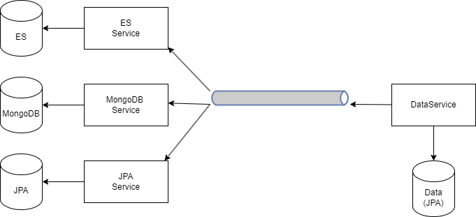

# Oracle Dual JSON
Inspired by the idea of viewing a relational database from a json / NoSQL perspective.

In this demonstrator a view from [ElasticSearch](https://www.elastic.co/), [MongoDB](https://www.mongodb.com/) 
and [Oracle 23c](https://www.oracle.com/database/free/) is created using [Spring Boot](https://spring.io/projects/spring-boot/).

The original idea/question was 'do we have a performance improvement if we store the whole relevant data model into a JSON structure in one table/document?'.

## System Overview
The overall system is created with the following idea in mind:

- Create a relational data model (Data) and fill it with data;
- The API of the system is JSON based;
- Create an input document used to 'search' data;
- Create an output document used as response.

As input/output different databases are used and brought in sync. This gives the following system:

The components are:

| Component       | Description                                                        |
|-----------------|--------------------------------------------------------------------|
| Data Service    | Contains the Data datamodel and the API to fill/sync all databases | 
| ES Service      | Fill the ElasticSearch input/output document                       | 
| MongoDB Service | Fill the MongoDB input/output document                             |                                                 
| JPA Service     | Fill the Oracle input/output document                              | 

A JMS queue is used to connect the different services. Topic 'RaceData.topic' is used to send data from 'Data Service' 
to the database services. Queue 'RaceData.processed' is used to detect if the given topic is processed.

## Run Application

A docker compose script is provided. Start the application with:

``docker compose up -d``

### Links

| Item                                                     | Link                              | Description                                               |
|----------------------------------------------------------|-----------------------------------|-----------------------------------------------------------|
| API : add data                                           | http://localhost:8080/data/{size} | Create {size} of races. All other data is related to that |
| API : sync data                                          | http://localhost:8180/data/sync   | Bring all data of databases in sync                       |
| JMS management                                           | http://localhost:8161             | username/password: CNL/CNL                                |
| [MongoDB viewer](https://hub.docker.com/_/mongo-express) | http://localhost:8081             | username/password: admin/pass                             | 
| ElasticSearch Viewer                                     | https://elasticvue.com/           | install it as browser plugin                              |

## Configuration
The following application parameters can be set. This is all done via [Spring](https://docs.spring.io/spring-boot/docs/current/reference/html/features.html#features.external-config).

| Configuration              | Description                                                                                         | Default |
|----------------------------|-----------------------------------------------------------------------------------------------------|--------:|
| data.teamsMultiplier       | multiplier to race size                                                                             |    0.25 |
| data.maxDrivers            | teams contains [ maxdrivers/2 - maxdriver ] drivers                                                 |      10 |
| data.raceMinLaps           | minimum number of possible laps                                                                     |      40 |
| data.raceMaxLaps           | maximum number of possible laps                                                                     |      80 |
| data.racePreviousDays      | race day is [ 0 - racePreviousDays ] from current day                                               |     365 |
| data.batch.size            | batch size when creating data and sending data to topic/queue                                       |         |
| data.processed.concurrency | Number of threads reading the incoming processed queue                                              |         |
| data.threads               | number of threads to handle topic messages. If value '**0**'sew then number of processors are taken |       0 |

The number of drivers, the number of laps of a given race and the race day are all generated from a random value in the given range.

## Remarks
During the development the following remarks are made:

### Performance
To improve performance loading, processing of data is done in parallel. In some higher load tests (100.000 races and higher) 
I noticed that performance was improved. A further investigation is needed to make this claim more concrete.

### JMS Listeners
Spring Boot uses **@JmsListener** to read from topics and queues. However, the concurrency setting appears to have different behavior. 
For queues if behaves as expected, more readers from the same queue. 
For a given topic it seems  the number of concurrency queues are created, so the same message was processed in parallel without a clear performance win. 
More investigation is need to know what exactly is going on.  

### JSON Relation Duality
The original idea was to create a demonstrator using Oracle 23c functionality 'JSON Relational Duality'. 
The SQL directory contains some attempts on this. However, there seems to be a limitation of 4Kb per JSON record 
and that didn't work for the given demonstrator. Therefore, it is converted to a JSON table/document approach.

## TODO List
- [ ] Dynamic Query building based on request;
- [ ] Explicit performance measurements to support claims about performance improvements.
- [x] Select which DB to use (1,2 or all of them)

## Further Information
- [JSON Relational Duality](https://github.com/oracle-samples/oracle-db-examples/blob/main/json-relational-duality/DualityViewTutorial.sql)
- [MongoDB interface on Oracle](https://blogs.oracle.com/database/post/installing-database-api-for-mongodb-for-any-oracle-database)
